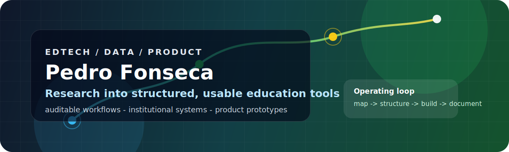

  

  
  
  

  I build EdTech, structured-data workflows, and digital products for education teams that need clarity, traceability, and usable interfaces.

---

## About Me

I work at the intersection of education, data strategy, and software engineering — building knowledge systems, auditable data workflows, and product prototypes for education teams. My public work spans public-data maps, institutional systems, dashboards, and tools that turn complex information into actionable interfaces.

Atuo na interseção entre educação, dados e engenharia de software — construindo sistemas de conhecimento, fluxos de dados auditáveis e protótipos de produto para times educacionais. Meu trabalho público inclui mapas de dados abertos, sistemas institucionais, dashboards e ferramentas que transformam informações complexas em interfaces acionáveis.

---

## What I Build

<table>
  <tr>
    <td width="33%">
      <strong>Knowledge systems</strong> 
      Learning tools, institutional memory, archives, and research operations designed for long-term use.
    </td>
    <td width="33%">
      <strong>Auditable data workflows</strong> 
      Public-data maps, reproducible methods, source review, evidence trails, and clear documentation.
    </td>
    <td width="33%">
      <strong>Product prototypes</strong> 
      Interfaces and dashboards that turn complex education routines into usable digital products.
    </td>
  </tr>
</table>

---

## Featured Projects

| Project | Description | Stack |
|---------|-------------|-------|
| [spotify-curation](https://github.com/pedrofernando0/spotify-curation) | Personalized playlist curation powered by your own library — no algorithm, no black box |   |
| [mapa-contatos-historia](https://github.com/pedrofernando0/mapa-contatos-historia-universidades-publicas) | Auditable mapping of Brazilian public universities with History programs and institutional contact evidence |   |
| [v0-pet-historia-usp-website](https://github.com/pedrofernando0/v0-pet-historia-usp-website) | Dashboard-style interface for cataloging documents, people, reports, and historical records |    |
| [pet-historia-usp-sistema](https://github.com/pedrofernando0/pet-historia-usp-sistema) | Public product brief for academic workflows, archive operations, and institutional memory |   |

---

## Toolbox

  
  
  
  
  
  
  
  
  

---

## GitHub Stats

  
  

  

---

## Explore

  
<strong>How I approach projects</strong>

   
  <ul>
    <li><strong>Map the real workflow</strong>: people, data, documents, decisions, and constraints.</li>
    <li><strong>Structure the evidence</strong>: sources, assumptions, edge cases, and reproducible methods.</li>
    <li><strong>Build the interface</strong>: practical tools that make complex information searchable and usable.</li>
    <li><strong>Document the system</strong>: READMEs, operating notes, and clear repository metadata.</li>
  </ul>

  
<strong>What I care about in software</strong>

   
  <ul>
    <li>Readable implementation before unnecessary abstraction.</li>
    <li>Interfaces designed for repeated use, not just first impressions.</li>
    <li>Data workflows that make uncertainty explicit instead of hiding it.</li>
    <li>Documentation that helps the next person understand what is true, current, and safe to change.</li>
  </ul>

---

## Let's Connect

  
  

---

  <strong>Education workflows deserve the same rigor as production software.</strong>

  <em>Last updated: 2026-05-24</em>

